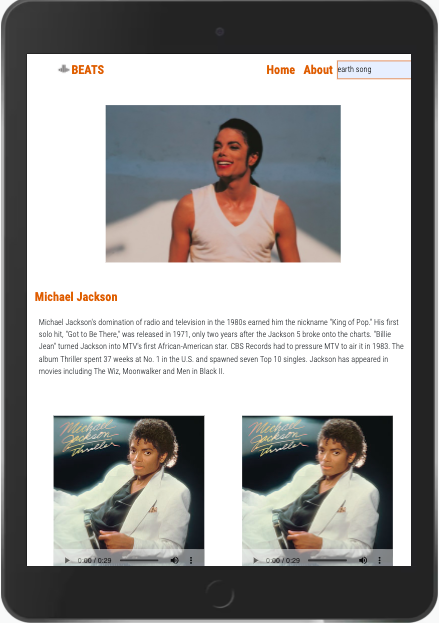

# Beats Music App 

# Check the project webpage:

Have a look at the project here: [Beats](https://reemasho.github.io/beats-usingNapsterAPI-project-/).
# App features
__Beats__ is a music app , I developed using [Napster API](https://developer.rhapsody.com/api/v2.2). you can listen to music samples using *Beats* app.
## Must have features:
* [x] app should be responsive.

 
* [x] Search input for a track name or artist.

 
* [x] The Home Page should diaplay top tracks, for each track:
  * [x] display the track image.
  * [x] display the track name.
  * [x] display the Artist name for each track.
  * [x] display the Album name for each track.

* [x] The artist page should display artist's information:

  * [x] display the artist image.
  * [x] display the artist name.
  * [x] display the artist bio, if it is provided in the API.
  * [x] display the artist top tracks.

* [x] The Album page should display:
   * [x] all the tracks in the Album.
   * [x] the album cover image.

## Nice have features:
* [ ] display genres and Subgenres.
* [ ] display playlists.
